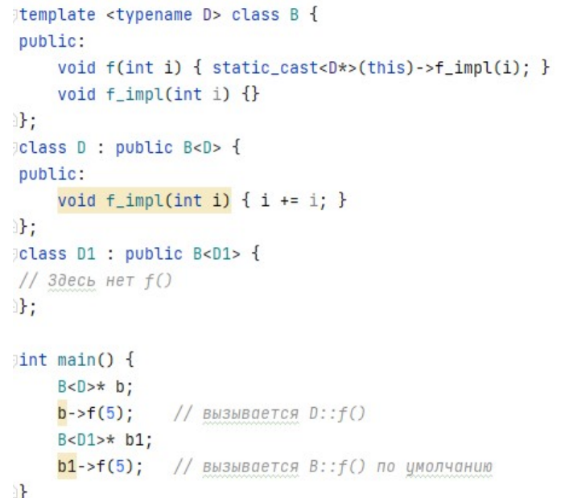

<!-- Картинка -->
<p align="center">

</p>

## Список тем
* [Cmake](#Cmake) (1-3)
* [Git](#Git) (4-6)
* [Отличия waterfall от agile](#Отличия-waterfall-от-agile) (7)
* [Алгоритм Флоида](#Алгоритм-Флоида) (8)
* [Классы и создание объектов](#Классы-и-создание-объектов) (9-23)
* [Перегрузки и переопределения](#Перегрузки-и-переопределения) (24-32)
* [goto](#Goto) (33-34)
* [RAII и r/l-value ссылки](#RAII-и-r/l_value-ссылки) (35-41)
* [Указатели](#Указатели) (42-45)
* [Типы](#Типы) (46-57)
* [SFINAE](#SFINAE) (58-60)
* [CRTP](#CRTP) (61-67)
* [Концепты](#Концепты) (68-76)
* [Декораторы](#декораторы) (77-85)

<details><summary>Список билетов</summary>

   [1](#1-билет)
    [2](#2-билет)
    [3](#3-билет)
    [4](#4-билет)
    [5](#5-билет)
    [6](#6-билет)
    [7](#7-билет)
    [8](#8-билет)
    [9](#9-билет)
    [10](#10-билет)
    [11](#11-билет)
    [12](#12-билет)
    [13](#13-билет)
    [14](#14-билет)
    [15](#15-билет)
    [16](#16-билет)
    [17](#17-билет)
    [18](#18-билет)
    [19](#19-билет)
    [20](#20-билет)
    [21](#21-билет)
    [22](#22-билет)
    [23](#23-билет)
    [24](#24-билет)
    [25](#25-билет)
    [26](#26-билет)
    [27](#27-билет)
    [28](#28-билет)
    [29](#29-билет)
    [30](#30-билет)
    [31](#31-билет)
    [32](#32-билет)
    [33](#33-билет)
    [34](#34-билет)
    [35](#35-билет)
    [36](#36-билет)
    [37](#37-билет)
    [38](#38-билет)
    [39](#39-билет)
    [40](#40-билет)
    [41](#41-билет)
    [42](#42-билет)
    [43](#43-билет)
    [44](#44-билет)
    [45](#45-билет)
    [46](#46-билет)
    [47](#47-билет)
    [48](#48-билет)
    [49](#49-билет)
    [50](#50-билет)
    [51](#51-билет)
    [52](#52-билет)
    [53](#53-билет)
    [54](#54-билет)
    [55](#55-билет)
    [56](#56-билет)
    [57](#57-билет)
    [58](#58-билет)
    [59](#59-билет)
    [60](#60-билет)
    [61](#61-билет)
    [62](#62-билет)
    [63](#63-билет)
    [64](#64-билет)
    [65](#65-билет)
    [66](#66-билет)
    [67](#67-билет)
    [68](#68-билет)
    [69](#69-билет)
    [70](#70-билет)
    [71](#71-билет)
    [72](#72-билет)
    [73](#73-билет)
    [74](#74-билет)
    [75](#75-билет)
    [76](#76-билет)
    [77](#77-билет)
    [78](#78-билет)
    [79](#79-билет)
    [80](#80-билет)
    [81](#81-билет)
    [82](#82-билет)
    [83](#83-билет)
    [84](#84-билет)
    [85](#85-билет)
</details>
<br></br>  
    
# Cmake
* ## 1-билет
    (Написать Cmake для проекта, состоящего из main.cpp, class1.h, class1.cpp. Стандарт С++ - 17.)
    ```Cmake
    cmake_minimum_required(VERSION "number")    # Минимальная потдерживаемая версия Cmake
    project(PROJECT)                            # Задает имя проекта и сохраняет его в переменной 
    set(CMAKE_CXX_STANDARD 17)                  # Установка используемого стандарта C++
    
    set(SOURCES                                 # Обьявление переменных SOURCES и HEADERS
	    main.cpp
        class1.cpp
    )
    set(HEADERS
        class1.h 
    )

    add_executable(${PROJECT_NAME}              # Добавляет задачу сборки с именем ${PROJECT_NAME}, 
                   ${SOURCES}                   # который будет создан из исходных файлов,  
                   ${HEADERS})                  # перечисленных при вызове команды.
    ```
* ## 2-билет
    (Алгоритм сборки библиотеки без зависимостей из исходных кодов, которые содержат CmakeLists.txt.)

    Пусть есть проект библиотеки в папке **~/my_lib** и мы хотим собрать ее по адресу **~/app**, тогда алгоритм сборки будет такой:
    ```bash
    cd ~/my_lib 
    mkdir build && cd build 
    cmake .. -DCMAKE_INSTALL_PREFIX=<директория установки>
    cmake --build . --target install -- -j<кол-во потоков>
    ```
* ## 3-билет
    (Добавление сторонней прекомпилированной библиотеки к своему проекту)

    Для этого необходимо добавить следующие строки в CMakeLists.txt проекта 
    ```Cmake
    set(LIB_DIR "/path/to/library")                    # Путь к директории с библиотекой
    include_directories(${LIB_DIR}/include)            # Добавление пути к заголовочным файлам библиотеки
    link_directories(${LIB_DIR}/lib)                   # Добавление пути к файлам библиотеки
    target_link_libraries(<имя_цели> <имя_библиотеки>) # Линковка библиотеки (объединения объектных файлов)
    ```

# Git
* ## 4-билет
    (Отличие checkout от switch.)
    
    git checkout - старая команда, для работы с ветками и файлами
    git switch - новая команда, для работы ТОЛЬКО с ветками. Для работы с файлами теперь тоже новая команда - restore

    ```bash
    git checkout -b <Название новой ветки>             # Создание новой ветки и переключение на неё
    git switch -с <Название новой ветки>               # Создание новой ветки и переключение на неё

    git checkout <Название ветки>                      # Переключение на существующую ветку
    git switch <Название ветки>                        # Переключение на существующую ветку

    git checkout <другая_ветка> -- <имя файла>         # Отменить изменения в рабочей директории для файла и установить версию из последнего коммита в другой 
                                                       # ветке (другую ветку можно не указывать, тогда будет взят последний коммит в текущей ветке)
    git switch -- file                                 # ОШИБКА

    git restore -s <другая ветка> file                 # новый способ откатить файл (здесь s = sorce,  а в качестве другой ветки можно взять, например,
                                                       # указатель на комит, предпредыдущий, тому, на который указывает master: master~2)
    ```

* ## 5-билет
    (Отличия rebase/merge/cherry-pick.)

    1. git rebase devel - собачка на молнии - "сшивает" коммиты по дате их создания (ветка devel "растворяется" в основной ветке)
    
    2. git git merge devel - пожарная лестница, все коммиты ветки devel крепятся в конец, образуется пересечение (devel остается отдельной веткой, к которой можно вернуться)
    
    3. git chery-pick idea - забрать коммиты из ветки idea
    


    P.S.
    1. git rebase master - ты синхронизируешься с главной веткой в которую коммитят все разработчики проекта, это полезно когда кто-то изменил участок кода с которым ты сейчас работаешь в своей ветке, дабы через неделю ты смог без проблем смержиться с master веткой. Обычно делается каждое утро перед началом рабочего дня и в конце когда фича готова.
    2.  git merge - обычно используется когда у вас 2 и более master ветки (к примеру master и prototype) в этих ветках очень много комитов (и rebase здесь не подходит) и обчно через пару недель, maintainer репозитория наработки из prototype ветки "сливает" в master ветку по средствам этого самого git merge.
    3. git chery-pick - ты забираешь комиты из одной ветки в другую, это бывает полезно когда изменения сделаные другим разработчиком в его ветке, прямо сейчас нужны тебе в твоей ветке, и что бы не писать этот код заново, ты забираешь его комит себе в ветку.


* ## 6-билет
    (Что нужно сделать, чтобы зафиксировать изменения в локальном репозитории и добавить их в удаленный репозиторий)

    * git status - проверка состояния репозитория (что модифицировано, что отслеживается, что ещё нет и т.п.)
    * git add <файл> - добавление файлов в индекс (становятся отслеживаемыми).
    * git rm <файл> - удаление файлов из индекса.
    * git commit -m <сообщение коммита> - фиксации отслеживаемых (проиндексированных) изменений в локальном репозитории.
    * git push - добавление изменений (зафиксированных коммитов) в удалённый репозиторий.
    * git pull - получение актуальных коммитов из удалённого репозитория. 

# Отличия-waterfall-от-agile
* ## 7-билет 
    (Отличия waterfall от agile)  
    Waterfall – это четко запланированный и детализированный подход, где исполнитель придерживается плану. Предполагает последовательный переход к каждому этапу разработки и невозможностью вернуться на шаг назад. Внести какие-либо изменения будет возможно только после релиза проекта. 
    Agile – прямая противоположность, которая предполагает гибкость разработки с возможностью внесения изменений на каждом этапе проекта. Ключевая особенность такого подхода - создание проекта в несколько циклов (итераций), в конце каждого виден конкретный результат, который позволяет понять, по какому пути двигаться дальше. Каждый цикл представляет собой завершенный мини-проект, в котором есть этапы анализа, планирования, тестирования и реализации.
    

# Алгоритм-Флоида
* ## 8-билет
    (Алгоритм Флоида)  
    Алгоритм для поиска петли в цикле:
    1) Начинают два указателя: заяц и черепаха
    2) Заяц за один ход продвигается вперед на два элемента,
    а черепаха на один
    3) Если они встретились, значит петля есть  
    (подробнее [тут](https://neerc.ifmo.ru/wiki/index.php?title=Алгоритм_Флойда))


# Классы и cоздание объектов
* ## 9-билет
    (Инварианты класса. Определение)

    **ОПР.** Утверждение, которое должно быть верно все время жизни объекта класса называется его **инвариантом**

    Инварианты класса необходимы для упрощение и удешевления его методов, так как им не нужно будет постоянно проверять их.
    #пример: List<>: 0 ≤ _size ≤ _items.Length 

    В С++ есть ряд язоковых средств, позволяющих сохранять инварианты классов:
    * механизм инкапсуляции (модификаторы досупа)
    * ссылки

* ## 10-билет
    (Инкапсуляция. Определение)

    **ОПР.** **Инкапсуляция** - один из принципов ООП. Её идея заключается в том, чтобы объединить данные и методы, работающие с этими данными в одном модуле, при этом, изолировав и сокрыв их от других

    Для инкапсуляции в С++ существуют модификаторы доступа к данным и методам класса (полям): [private, protected, public].

* ## 11-билет
    (Модификатор доступа в классе по умолчанию. Модификатор доступа в структуре по умолчанию.)

    * **Class**: private
    * **Struct**: public

* ## 12-билет
    (Наследование в классе по умолчанию. Наследование в структуре поумолчанию.)

    * **Class**: наследуется как private
    * **Struct**: наследуется как public

* ## 13-билет
    (Отличия private/protected/public (внутри определения класса и при наследовании).)

    1) Внутри определения класса:
    * **private**: элемент не доступен никому кроме -методов, реализованных в этом классе - методов дружественных классов -дружественных функций.
    * **protected**: элемент доступен только -методам этого класса -методам класса наследника (но не экземпляру) - друзьям.
    * **public**: элемент доступен всем методам и функциям в программе. Исключение составляет случай, когда клас унаследован как private. Тогда даже public-элементы этого класса будут недоступны в унаследованных классах.

    *P.S. friend - это плохо!*

    [Подробнее c рисуночками](https://www.bestprog.net/ru/2020/11/08/c-access-modifiers-private-protected-public-encapsulating-data-in-a-class-ru/)

    2. При наследовании (A - родитель B; C - родитель A):
    * **private**: private поля A недосутпны в классе B; public и protected поля A доступны в классе (но не из экзмепляров) B; поля A недоступны С.  
    
    
    * **protected** : Модификатор доступа protected ограничивает доступ из экземпляров унаследованных классов и не ограничивает доступ из методов унаследованных классов.  
    * **public**: protected и public A доступны из методов B; private A недоступны из методов B; public A доступны из экземпляров B; private и protected A недоступны из экземпляров B.  
    
    
    [Подробнее c рисуночками](https://www.bestprog.net/ru/2020/11/09/c-using-private-protected-public-access-modifiers-when-inheriting-classes-ru/)

* ## 14-билет
    (Отличие malloc/free от new/delet.)

    <table class="s-table">
    <thead>
    <tr>
    <th><font style="vertical-align: inherit;"><font style="vertical-align: inherit;">Особенность</font></font></th>
    <th><code>new</code><font style="vertical-align: inherit;"><font style="vertical-align: inherit;">/</font></font><code>delete</code></th>
    <th><code>malloc</code><font style="vertical-align: inherit;"><font style="vertical-align: inherit;">/</font></font><code>free</code></th>
    </tr>
    </thead>
    <tbody>
    <tr>
    <td><font style="vertical-align: inherit;"><font style="vertical-align: inherit;">Память, выделенная из</font></font></td>
    <td><font style="vertical-align: inherit;"><font style="vertical-align: inherit;">«Бесплатный магазин»</font></font></td>
    <td><font style="vertical-align: inherit;"><font style="vertical-align: inherit;">«Куча»</font></font></td>
    </tr>
    <tr>
    <td><font style="vertical-align: inherit;"><font style="vertical-align: inherit;">Возвращает</font></font></td>
    <td><font style="vertical-align: inherit;"><font style="vertical-align: inherit;">Полностью типизированный указатель</font></font></td>
    <td><code>void*</code></td>
    </tr>
    <tr>
    <td><font style="vertical-align: inherit;"><font style="vertical-align: inherit;">При неудаче</font></font></td>
    <td><font style="vertical-align: inherit;"><font style="vertical-align: inherit;">Выбрасывает (никогда не возвращается </font></font><code>NULL</code><font style="vertical-align: inherit;"><font style="vertical-align: inherit;">)</font></font></td>
    <td><font style="vertical-align: inherit;"><font style="vertical-align: inherit;">Возвращает </font></font><code>NULL</code></td>
    </tr>
    <tr>
    <td><font style="vertical-align: inherit;"><font style="vertical-align: inherit;">Требуемый размер</font></font></td>
    <td><font style="vertical-align: inherit;"><font style="vertical-align: inherit;">Рассчитывается компилятором</font></font></td>
    <td><font style="vertical-align: inherit;"><font style="vertical-align: inherit;">Должен быть указан в байтах</font></font></td>
    </tr>
    <tr>
    <td><font style="vertical-align: inherit;"><font style="vertical-align: inherit;">Обработка массивов</font></font></td>
    <td><font style="vertical-align: inherit;"><font style="vertical-align: inherit;">Имеет явную версию</font></font></td>
    <td><font style="vertical-align: inherit;"><font style="vertical-align: inherit;">Требует ручных расчетов</font></font></td>
    </tr>
    <tr>
    <td><font style="vertical-align: inherit;"><font style="vertical-align: inherit;">Перераспределение</font></font></td>
    <td><font style="vertical-align: inherit;"><font style="vertical-align: inherit;">Не обрабатывается интуитивно</font></font></td>
    <td><font style="vertical-align: inherit;"><font style="vertical-align: inherit;">Простой (без конструктора копирования)</font></font></td>
    </tr>
    <tr>
    <td><font style="vertical-align: inherit;"><font style="vertical-align: inherit;">Вызов обратного</font></font></td>
    <td><font style="vertical-align: inherit;"><font style="vertical-align: inherit;">Реализация определена</font></font></td>
    <td><font style="vertical-align: inherit;"><font style="vertical-align: inherit;">Нет</font></font></td>
    </tr>
    <tr>
    <td><font style="vertical-align: inherit;"><font style="vertical-align: inherit;">Случаи нехватки памяти</font></font></td>
    <td><font style="vertical-align: inherit;"><font style="vertical-align: inherit;">Можно добавить новый распределитель памяти</font></font></td>
    <td><font style="vertical-align: inherit;"><font style="vertical-align: inherit;">Не обрабатывается кодом пользователя</font></font></td>
    </tr>
    <tr>
    <td><font style="vertical-align: inherit;"><font style="vertical-align: inherit;">Переопределяемый</font></font></td>
    <td><font style="vertical-align: inherit;"><font style="vertical-align: inherit;">Да</font></font></td>
    <td><font style="vertical-align: inherit;"><font style="vertical-align: inherit;">Нет</font></font></td>
    </tr>
    <tr>
    <td><font style="vertical-align: inherit;"><font style="vertical-align: inherit;">Использование конструктора/деструктора</font></font></td>
    <td><font style="vertical-align: inherit;"><font style="vertical-align: inherit;">Да</font></font></td>
    <td><font style="vertical-align: inherit;"><font style="vertical-align: inherit;">Нет</font></font></td>
    </tr>
    </tbody>
    </table>
    
    Технически память, выделенная с помощью, newпоступает из «Free Store», а память, выделенная с помощью, mallocпоступает из «кучи». То, являются ли эти две области одинаковыми, является деталью реализации, что является еще одной причиной, по которой mallocих new **НЕЛЬЗЯ СМЕШИВАТЬ**.

* ## 15-билет
    (Когда не применима инициализация «в круглых скобках», «после =», «фигурная»)  
    В **круглых скобках** неприменима при инициализации полей класса по умолчанию
    
    **После =**  
    
    **Фигурные скобки** в зависимости от флагов компилятора неприменимы с сужающими преобразованиями
    

* ## 16-билет
    (Сужающие преобразованию и разные виды инициализации («в круглых скобках», «после =», «фигурная»))
    см. картинку выше

* ## 17-билет
    («Наиболее неприятный анализ» в С++ и разные виды инициализации («в
круглых скобках», «фигурная»).)  
    
    Пояснение: здесь компилятор воспринимает строчку my_class_t m1(list_t(), list_t()); как объявление функции
    
    Здесь будет выведено 10 2  
    Так как при наличии конструктора, принимающего std::initializer_list в качестве
    аргумента, будет использован именно этот конструктор даже когда он подходит не
    лучшим образом.  
    То есть вектор b это [10, 20]

* ## 18-билет
    (В каких случаях возникает двойная инициализация? Как избежать?)
    
    Выведется  
    default  
    direct  
    Пояснение: Присваивая в теле конструктора мы инициализируем дважды.  
    
    Если заменить Node1 на Node2, вывод будет direct   
    Пояснение: Чтобы уйти от двойной инициализации предусмотрены списки инициализации

* ## 19-билет
    (В каком порядке выполняется инициализация полей класса с использованием списков инициализации (в порядке расположения полей класса или в порядке, определенном в списке инициализации)?)  
    Список инициализации выполняется строго в том порядке, в каком поля определены в классе (не в том в каком они записаны в списке).

* ## 20-билет
    (Что такое RVO? Пример?)
    Спецсемантика копирования: RVO (return value optimization)
    RVO (Return Value Optimization) – оптимизация компилятора, позволяющая в некоторых случаях не создавать локальный объект, который будет использован как возвращаемое значение.
    Вместо этого возвращаемый объект будет сконструирован на месте вызова функции. Это позволяет устранить лишний вызов конструктора перемещения/копирования.
    Пример:
    

* ## 21-билет
    (Полиморфизм. Определение. Виды полиморфизма.)
    Полиморфизм – концепция ООП, которая позволяет для единого интерфейса представить множество реализаций в зависимости от аргументов.
    Полиморфизм делится на статический (выбор реализации осуществляется во время компиляции) и динамический (выбор реализации осуществляется во время выполнения).
    Статический полиморфизм – перегрузки функций, шаблоны.
    Динамический полиморфизм– виртуальные функции.

* ## 22-билет
    (Примеры статического полиморфизма в С++)
    

* ## 23-билет
    (Примеры динамического полиморфизма в С++.)
    Реализуется при помощи виртуальных функций.
    

# Перегрузки и переопределения
* ## 24-билет 
    (__Отличие overloading от overriding__)  
    Перегрузка функций (overloading) в - это создание нескольких функций с одинаковым именем, но разными параметрами. Компилятор выбирает нужную функцию на основе типов переданных аргументов при вызове функции.

    Переопределение функций (overriding) в - это создание новой функции с тем же именем и параметрами, что и у существующей функции в базовом классе. При вызове функции у объекта производного класса будет вызываться переопределенная версия этой функции, а не базовая.

* ## 25-билет
    (__Ключевое слово virtual__)  
    Используется для указания, что метод является виртуальным. Виртуальные методы позволяют производным классам переопределять базовые методы и предоставляют возможность вызывать методы производных классов через указатель на базовый класс. 
    подробнее [тут](https://habr.com/ru/articles/51229/)

* ## 26-билет 
    (__Ключевое слово override__)  
    Используется для указания того, что метод является переопределенным методом базового класса. Это позволяет компилятору проверить, что метод действительно переопределен, и выдать ошибку, если это не так. Использование ключевого слова override повышает безопасность кода и упрощает его поддержку.

* ## 27-билет
    (__Абстрактный класс. Определение__)  
    Абстрактный базовый класс определяет только интерфейс; реализовать
    его – задача конкретного производного класса. Если базовый класс содержит
    чисто виртуальную функцию, то любой производный от него класс, экземпляры которого создает программа, должен предоставить ее реализацию. Иными
    словами, объект абстрактного базового класса создать нельзя. Однако в программе может быть определен указатель или ссылка на объект базового класса.
    В действительности он указывает на объект производного класса, но оперировать им можно через интерфейс базового.


* ## 28-билет
    (Использование аргументов со значениями по умолчанию в виртуальных функциях.)

    Виртуальные функции **связываются динамически** (адреса функций определяются с помощью таблицы виртуальных функций). Обычные функции **связываются статически** (на этапе компиляции). 

    Аргументы по умолчанию тоже связываются статически, т.е. зависят от статического типа.

    То есть запуск такого кода преведёт к ошибке
    ```c++
    struct Base {
        virtual int foo(int x = 14) { return x; }
    };

    struct Derived: public Base {
        int foo(int x) override { return x;}
    };

    int main(){
            Derived d{};
            std::cout << d.foo();
    }
    ```
        >> error: no matching function for call to ‘Derived::foo()’
    Так как аргумент по у молчанию для Derived::foo(int) не определён.

    ```c++
    struct Base {
        virtual int foo(int x = 14) { return x; }
    };

    struct Derived: public Base {
        int foo(int x = 24) override { return x;}
    };

    int main(){
            Derived d{};
            std::cout << d.foo();
    }
    ```
        >> 24

    > res: лекция 1, слайд 34
* ## 29-билет
    (NVI. Пример.)

    **NVI** - non-virtual interfase.
    Если нужен интерфейс с аргументами по умолчанию, его можно сделать невиртуальным, чтобы никто не смог их переопределить. 
    ```c++
    struct BaseNVI {
        int foo(int x = 14) { return foo_impl(x); }
    private:
        virtual int foo_impl(int a) { return a; }
    };

    struct DerivedNVI: public BaseNVI{
        int foo_impl(int a) override { return a*2;}
    };

    int main(){
        DerivedNVI d{};
        std::cout << d.foo();
    }
    ```
        >> 28
    > res: лекция 1, слайд 35
* ## 30-билет
    (Может ли существовать шаблон виртуального метода?)
    Нет. 
    > res: лекция 1, слайд 37

* ## 31-билет
    (Можно ли перегружать виртуальные функции?)
    Да.
    > res: лекция 1, слайд 37
* ## 32-билет
    (Как добавить в overloading set класса-наследника методы базового класса являющиеся перегрузками виртуального метода?)
    ```c++
    struct Matrix{
        virtual void pow(double x) { cout << "Matrix double: " << x << endl; }
        virtual void pow(int x) { cout << "Matrix int: " << x << endl; }
    };

    struct SparceMatrix: Matrix{
        void pow(int x) { cout << "SparceMatrix int: " << x << endl; }
    };

    int main(){
        Matrix* m = new SparceMatrix;
        m->pow(1.5);
        m->pow(4);
        SparceMatrix sm;
        sm.pow(1.5);
        sm.pow(4);
    }
    ```
        >> Matrix double: 1.5
        >> SparceMatrix int: 4

        >> SparceMatrix int: 1
        >> SparceMatrix int: 4

    Сделать доступной перегрузку pow для double можно, если ввести в область видимости функции Matrix с использованием using

    ```c++
        struct Matrix{
        virtual void pow(double x) { cout << "Matrix double: " << x << endl; }
        virtual void pow(int x) { cout << "Matrix int: " << x << endl; }
    };

    struct SparceMatrix: Matrix{
        using Matrix::pow;
        void pow(int x) { cout << "SparceMatrix int: " << x << endl; }
    };

    int main(){
        Matrix* m = new SparceMatrix;
        m->pow(1.5);
        m->pow(4);
        SparceMatrix sm;
        sm.pow(1.5);
        sm.pow(4);
    }
    ```
        >> Matrix double: 1.5
        >> SparceMatrix int: 4

        >> Matrix double: 1.5
        >> SparceMatrix int: 4
    > res: лекция 1, слайд 38;  
    > https://radioprog.ru/post/1274;  
    > https://radioprog.ru/post/1275

# goto

* ## 33-билет

	(Чем плохо goto?)

	goto ужасен, потому что:
	- можно вернуться назад или перескочить в другую область видимости
	- делает код запутанным и нечитабельным
	- можно проскочить обьявление переменной

* ## 34-билет

	(Примеры goto-маскирующих конструкций)

	- ```break```
	- ```continue```
	- ```switch```
	- ```return```
	- и т.п.

# RAII и r/l_value ссылки

* ## 35-билет
    (RAII. Концепция.)
    RAII - resource acqupation is initialization. Это программная идиома, смысл которой заключается в том, что с помощью тех или иных программных механизмов получение некоторого ресурса неразрывно совмещается с инициализацией, а освобождение — с уничтожением объекта. Типичным (хотя и не единственным) способом реализации является организация получения доступа к ресурсу в конструкторе, а освобождения — в деструкторе соответствующего класса.
    > res: лекция 2, слайд 9

* ## 36-билет
    (Инвариант умного указателя с единственным(уникальным) владением.)
    "Никто, кроме меня, не имеет доступ к указателю, который я храню."  
    Пример такого класса
    ```c++
        template<typename T> class ScopedPointer{
            T* ptr;
        public:
            ScopedPointer(T* ptr_ = nullptr): ptr(ptr_) {};
            ~ScopedPointer() { delete ptr; }
            T& operator*() { return *ptr; }
            const T& operarot*() const { return *ptr; }
            T* operator->() { return ptr; }
            const T* operator->() const { return ptr; }
        }
    ```
    > res: лекция 2, слайд 11

* ## 37-билет
    (Drill down behaviour. Где применяется?)  
    Вызов p-> эквивалентен (p.operator->())->x и так сколько угодно раз. То есть стрелка "зарывается" в глубину на сколько может. Это и называется dill down behavior. Благодаря такому поведению всё, что можно получить - конкретное поле класса.
    ```c++
    struct A{
        int n;
        A* operator->() { std::cout << "A::operator->()" << endl;  return this; }
    };

    struct B{
            A* a;
            A* operator->() { std::cout << "B::operator->()" << endl; return  a;}
    };

    int main(){
            A a_obj {5};
            A* a_ptr = new A{2};
            B b_obj {a_ptr};

            cout << a_obj->n << endl;
            cout << b_obj->n << endl;
    }

    ```
        >> A::operator->()  
        >> 5  
        >> B::operator->()
        >> 2   

    > res: лекция 2, слайд 19

* ## 38-билет
    (Lvalue и rvalue. Отличия.)  
    lvalue представляет собой объект, который занимает идентифицируемое место в памяти (например, имеет адрес). Другими словами, некое выражение, ссылающееся на область памяти.

    rvalue — это не lvalue (любое выражение является либо lvalue, либо rvalue). Таким образом из определения lvalue следует, что rvalue — это выражение, которое не представляет собой объект, который занимает идентифицируемое место в памяти.

    Пример
    ```c++
    int var;
    var = 4;
    ```
    Оператор присваивания ожидает lvalue с левой стороны, и var является lvalue, потому что это объект с идентифицируемым местом в памяти.
    ```c++
    4 = var;       // ERROR!
    (var + 1) = 4; // ERROR!
    ```
    Ни константа 4, ни выражение var + 1 не являются lvalue
    (что автоматически их делает rvalue). Они не lvalue, потому что оба являются временным результатом выражений, которые не имеют определённого места в памяти (то есть они могут находится в каких-нибудь временных регистрах на время вычислений). Таким образом, присваивание в данном случае не несёт в себе никакого семантического смысла. Иными словами — некуда присваивать.

      
    **Доп инфа: преобразвания между lvalue и rvalue.**  
    Преобразование возможно лишь в одну сторону: lvalue->rvalue. Обратное бы нарушило суть lvalue согласно определению.
    ```c++
    int a = 1;        // a - lvalue
    int b = 2;        // b - lvalue
    int c = a + b;    // '+' требует rvalue, поэтому a и b конвертируются в rvalue 
                      // и rvalue возвращается в качестве результата
    ```
    Это не означает, что lvalue не могут быть получены из rvalue явным способом. Например, унарный оператор '*' (разыменование) принимает rvalue в качестве аргумента, но возвращает lvalue в качестве результата. 
    ```c++
        int arr[] = {1, 2};
        int* p = &arr[0];
        *(p + 1) = 10;   // OK: p + 1 rvalue, однако *(p + 1) уже lvalue
    ```
    Обратно, унарный оператор '&' (адрес) принимает lvalue как аргумент и производит rvalue.
    ```c++
        int var = 10;
        int* bad_addr = &(var + 1);  // ОШИБКА: требуется lvalue для унарного оператора '&'
        int* addr = &var;            // ОК: var - lvalue
        &var = 40;                   // ОШИБКА: требуется lvalue с левой стороны
                                    //         оператора присваивания
    ```
    > res: лекция 2, слайд 22;  
    > https://habr.com/ru/articles/348198/

* ## 39-билет
    (Rvalue ссылки.)  
    В C++11, если X – это тип, то X& – это lvalue reference, а X&& – это rvalue reference для этого типа. При этом важно понимать, что X&, X&& – это разные типы. С одной стороны, семантически они похожи, и о них можно говорить как о "ссылках вообще".  Тем не менее, поскольку это разные типы, для них работает перегрузка:
    ```c++
    int a, b;
    foo(int &x);
    foo(int &&x);
    foo(a * b); /* вызовет foo(int &&x) */
    foo(a); /* вызовет foo(int &x) */
    ```
    Ссылки Rvalue поддерживают реализацию семантики перемещения, что может значительно повысить производительность приложений. Семантика перемещения позволяет создавать код, который переносит ресурсы (например, динамически выделяемую память) из одного объекта в другой. Семантика перемещения работает, так как она позволяет передавать ресурсы из временных объектов: те, на которые нельзя ссылаться в других местах программы.
    > res: лекция 2, слайд 23;  
    > https://learn.microsoft.com/ru-ru/cpp/cpp/rvalue-reference-declarator-amp-amp?view=msvc-170&viewFallbackFrom=vs-2019;
    > https://www.rsdn.org/article/cpp/Cpp11NewStd.xml;  
    > RVO и NRVO: https://habr.com/ru/companies/vk/articles/666330/

* ## 40-билет
    (Что делает std::move?)  
    Функция move сама по себе не выполняет никаких перемещений, несмотря на название, а делает все возможное чтобы в данном конкретном примере вызвать конструктор перемещения - Vector(Vector&& rhs). То есть она из любого аргумента std::move делает rvalue. Эта функция в удовлетворяющем стандарту (20.2.3) виде может быть определена так:
    ```c++
    template<class T> 
    T&& std::move(T& a) noexcept
    {  
        returnstatic_cast<T&&>(a);
    }
    ```
    Пример её использования в реализации библиотечной функции std::swap из C++11
    ```c++
    template<class T> 
    void swap(T& a, T& b) 
    { 
        T tmp(std::move(a)); /* в tmp перемещается значение a, это гораздо дешевле */
        a = std::move(b); 
        b = std::move(tmp);
  } 
    ```
    Идея в том, что теперь обмен значениями может быть семантически выражен как обмен значениями, а не копирование (а значит, и оптимизирован соответствующим образом). Rvalue references позволяют (совместно с std::move) по-новому взглянуть на ссылки. Получается более тонко различать такие термины естественного языка, как "копирование", "присваивание значения", "присваивание результата" на языке C++. Это в свою очередь открывает как простор к оптимизациям, так и возможности более аккуратного выражения старых идиом. Хороший пример правильного использования rvalue references – это std::unique_ptr. Умение уместно использовать rvalue references – важная черта, отличающая программиста на C++11.

    **Доп инфа: RVO**  
    Но кроме std::move, для оптимизации используется ещё RVO и NRVO принципы. RVO в основном означает, что компилятору разрешено избегать создания временных объектов для возвращаемых значений, даже если они имеют побочные эффекты.
    ```c++
    Snitch ExampleRVO() {
        return Snitch();
    }

    int main() {
        Snitch snitch = ExampleRVO();
    }
    ```
    С использованием RVO:  

        >> $ clang++ -std=c++11 main.cpp && ./a.out  
        >> c'tor  
        >> d'tor  
    Без него (ключ -fno-elide-constructors его отключает)  

        >> $ clang++ -std=c++11 -fno-elide-constructors main.cpp && ./a.out  
        >> c'tor  
        >> move c'tor  
        >> d'tor  
        >> move c'tor  
        >> d'tor  
        >> d'tor  


    > res: лекция 2, слайд 33;  
    > https://habr.com/ru/articles/587644/;  
    > https://stackoverflow.com/questions/3413470/what-is-stdmove-and-when-should-it-be-used-and-does-it-actually-move-anythi;  
    > https://shaharmike.com/cpp/rvo/

* ## 41-билет
    (Правило нуля, трех, пяти.)  
    **Правило трёх** - правило в С++, гласящее, что если класс или структура определяет один из следующих методов, то они должны явным образом определить все три метода: Деструктор, Конструктор копирования, Оператор присваивания копированием.    
      
    С выходом одиннадцатого стандарта правило расширилось и стало называться **правилом пяти**. Теперь при реализации конструктора необходимо реализовать: Деструктор, Конструктор копирования, Оператор присваивания копированием, Конструктор перемещения, Оператор присваивания перемещением.  
      
    **Правило нуля** - если ничего из специальных функций-членов не определено пользователем, то (с учетом переменных-членов) компилятор предоставит реализации по умолчанию для каждой из них. Правило Ноля заключается в том, что тот сценарий, когда не нужно определять ничего из специальных функций-членов, должен быть предпочтительным.
    > res: лекция 2, слайд 34

# Указатели

* ## 42-билет
    (Виды умных указателей.)  
    Динамически выделяемые массивы (например, new T[N]) необходимо удалять с помощью другого оператора (например, delete[]). Поэтому приходится отслеживать, что вы выделили, и соответственно вызывать нужный оператор.
    Ещё одна проблема заключается во владении. Сторонняя функция возвращает указатель: а не динамически ли были выделены эти данные? Если да, то кто отвечает за очистку? Невозможно получить такую информацию, просто посмотрев на возвращаемый тип.    
    Умные указатели были созданы для устранения вышеупомянутых неудобств.   
      
    По сути, они обеспечивают автоматическое управление памятью: когда умный указатель больше не используется, то есть выходит из области видимости, память, на которую он указывает, автоматически высвобождается. Традиционные указатели теперь также называют «обычными» указателями.  

* std::unique_ptr — умный указатель, владеющий динамически выделенным ресурсом;
* std::shared_ptr — умный указатель, владеющий разделяемым динамически выделенным ресурсом. Несколько std::shared_ptr могут владеть одним и тем же ресурсом, и внутренний счетчик ведет их учет;
* std::weak_ptr — подобен std::shared_ptr, но не увеличивает счетчик.
    > подбобнее: https://habr.com/ru/companies/piter/articles/706866/

* ## 43-билет
    (Отличие unique_ptr от shared_ptr)  
    Про unique_ptr:  
    * ​​std::unique_ptr воплощает в себе семантику исключительного владения.
    * Перемещение std::unique_ptr передает владение от исходного указателя целевому.
    * Интеллектуальные указатели std::unique_ptr легко преобразуются в интеллектуальные указатели std::shared_ptr, однако неявных преобразований классических указателей в умные не предусмотрено.
    * Реализация unique_ptr предполагает отказ от копирования, совмещенный с семантикой перемещения
    * Однако этот вариант не предусматривает совместного владения ресурсом  
      
        
    Про shared_ptr:  
    * Пока счетчик ссылок не нулевой, данные Node сохраняются
    * Все владеющие указатели могут читать и изменять их;
    * Специальная структура – контрольный блок действительно владеет ресурсом

* ## 44-билет
    (Отличие weak_ptr и shared_ptr.)
    
    В этом случае эти два указателя никогда не умрут, потому что у обоих счетчик 2  
    Для решения проблемы создали weak_ptr  
    * В отличии от сырых - слабый указатель знает когда объект больше не существует;
    * Слабый указатель можно проверить на истечение срока жизни;
    * Слабый указатель нельзя разыменовать;
    * Но… Его можно превратить в сильный и потом разыменовать  
  
    

* ## 45-билет
    (Способы инициализации shared_ptr)
    ```c++
    std::shared_ptr <Node> p1 = std::make_shared<Node>();
    std::shared_ptr <Node> p2{new Node()};
    ```
# Типы

* ## 46-билет
	(ODR) 

	У каждой сущности в С++ есть обьявление (declaration) и определение (definition).

	Declaration  | Definition
	------------- | -------------
	class X;  | class X { int foo(); };
	int bar();  | int bar() { return 42; }
	extern int x; | int x = 10;

	[**ODR**](https://ru.wikipedia.org/wiki/%D0%9F%D1%80%D0%B0%D0%B2%D0%B8%D0%BB%D0%BE_%D0%BE%D0%B4%D0%BD%D0%BE%D0%B3%D0%BE_%D0%BE%D0%BF%D1%80%D0%B5%D0%B4%D0%B5%D0%BB%D0%B5%D0%BD%D0%B8%D1%8F) - _one definition rule_ - сколько угодно обьявлений, но не более одного определения.

	Однако шаблоны нарушают ODR, т.к. для каждого типа, с которым была вызвана функция, компилятор генерируетс новое определение:
	``` c++
	//// foo.h

	template <typename T> T foo(T x) {  /* ... */  }
	```
	``` c++
	//// module1.cpp

	// int foo(int x);

	foo<int>(1);

	// int foo(int x) { /* ... */ }
	```
	``` c++
	//// module2.cpp

	// double foo(double x);

	foo<double>(2.);

	// double foo(double x) { /* ... */ }
	```
	Для шаблонов исключение в ODR, они работают.
	> 3-я лекция, 16-17 слайды

* ## 47-билет
	(Include guards)

	[**Include guards**](https://ru.wikipedia.org/wiki/Include_guard) - защита от повторного подключения файла при использовании ```#include```. Использование их гарантирует, что при повторных подключениях, файл не будет подключаться.
	``` c++
	//// foo.h

	#ifndef FOO_H
	#define FOO_H

	int foo();

	#endif
	```
	Аналог include guards - ```#pragma once```. В стандарте ее нету, но она поддерживается почти всеми компиляторами. Только стоит быть осторожным с ней, т.к. задача определения идентичности файла по указанному пути, в общем случае, довольно трудная, и нет гарантий, что в компиляторе она хорошо решена.
	``` c++
	//// foo.h

	#pragma once

	int foo();
	```
* ## 48-билет
    (CV-квалификаторы при выводе типов)
    
    [**CV-квалификаторы**](https://bestprogrammer.ru/programmirovanie-i-razrabotka/kvalifikatory-c-i-spetsifikatory-klassov-hraneniya) (const and volatile qualifiers):
    
    - ```const``` - запрещает менять значение переменной
    - ```volatile``` - запрещает компилятору оптимизировать переменную ([подробнее](https://habr.com/ru/articles/673428/))

    **Вывод типов** - возможность компилятора самостоятельно определить тип выражения.
    ``` c++
    int x = std::max(1, 2);  // вызовет std::max<int> (int, int)

    int y = std::max(1, 2.); // error: 'int' vs 'double'
    ```
    При выводе типов внешние cv-квалификаторы и ссылки режутся:
    ``` c++
    const int& a = 1;
    const int& b = 2;
    std::max(a, b);          // вызовет std::max<int> (int, int)
    ```
    Если шаблон был уточнен, то cv-квалификаторы сохраняются:
    ``` c++
    template<typename T> void foo(const T& x);
    
    const int& a = 1;
    foo(a);                  // вызовет foo<int> (const int&)
    ```
	> 3-я лекция, 19-20 слайды
* ## 49-билет
    (Манглирование имен. (Как перегрузки функций представляются компилятором))
    
    В С++ можно перегружать функции. Но в скомпилированном коде нету информации о типе данных аргументов. Чтобы различать перегруженные функции, компилятор выполняет **манглирование**: каким-то образом преобразует имя функции под каждую перегрузку. Например, он может дописывать к имени размер аргументов в байтах. В стандарте про манглирование ничего не написано, поэтому каждый компилятор решает эту проблему как хочет.
    
* ## 50-билет
    (Правила разрешения перегрузки для нешаблонных функций)
    
    - **Идеальное совпадение выигрывает**
        - Правильный тип 
        ``` c++
        int foo(const int&); // 1
        int foo(short);      // 2
        
        foo(1);              // вызовет 1
        ```
        ``` c++
        int foo(const int&); // 1
        int foo(int&);       // 2
        
        foo(1);              // вызовет 1
        int y;
        foo(y);              // вызовет 2
        ```
        - Если идеальных совпадений несколько - конфликт
        ``` c++
        int foo(const int&); // 1
        int foo(int);        // 2
        
        foo(1);              // ERROR
        ```
    - **Все стандартные преобразования равны**
        - Все стандартные преобразования одноранговые
        ``` c++
        int foo(long long);  // 1
        int foo(char);       // 2
        
        foo(1);              // ERROR
                             // компилятор не знает, к какому типу приводить int
        ```
        - Любые стандартные преобразования выигрывают у пользовательских
        ``` c++
        struct MyClass { 
            MyClass (int);
        };
        
        int foo(char);       // 1
        int foo(MyClass);    // 2
        
        foo(1);              // вызовет 1
        ```
    - **[Многоточия](https://radioprog.ru/post/1202) проигрывают почти всему** 
        - Проигрывают и стандартным, и пользовательским преобразованиям
        ``` c++
        void foo(int);           // 1
        void foo(char);          // 2
        void foo(MyClass);       // 3
        void foo(...);           // 4

        foo(1);                  // Приоритет вызова функций от большего к меньшому: 1, 2, 3, 4
                                 // То есть, если есть 1, то вызовет 1, если нет, то 2 и т.д.
        ```
        - Выигрывают только у неправильных ссылок
        ``` c++
        void foo(...);           // 1
        void foo(int&);          // 2
        
        foo(1);                  // вызовет 1
        ```
	> 3-я лекция, 27-30 слайды

    **Ограничения при перегрузке**:
    - Функция не может быть перегружена cv-квалификатором:
    ``` c++
    void f(int x);
    void f(const int x);         // ERROR
    
    void f(char* x);
    void f(char* const x);       // ERROR 
    ```
    
    - К cv-квалификаторам внешнего типа (квалификаторы, ограничивающие изменение внешней переменной), это не относится:
    ``` c++
    void f(int& x);
    void f(const int& x);        // OK
    
    void f(char* x);
    void f(const char* x);       // OK 
    ```
    > 3-я лекция, 26-ой слайд

* ## 51-билет
    (Правила разрешения перегрузки для шаблонных функций)
    
    - Точно подходящая функция выигрывает у шаблона
        - Даже если шабло подходит идеально
        ``` c++
        void foo(int);                     // 1
        template<typename T> void foo(T);  // 2
        
        foo(1);                            // вызовет 1
        ```
        - Можем попросить вызвать шаблон
        ``` c++
        foo<>(1);                          // вызовет 2
        foo<int>(1);                       // вызовет 2
        ```
        - Стандартные преобразования проигрывают шаблону
        ``` c++
        foo(1.);                           // вызовет 2
        ```
    - Более специальный шаблон выигрывает у менее специального
    ``` c++
    template<typename T> void foo(T);      // 1
    template<typename T> void foo(T*);     // 2
    template<typename T> void foo(T**);    // 3
    template<typename T> void foo(T***);   // 4
    
    int*** a;
    foo(a);                                // вызовет 4
    foo<int**>(a);                         // вызовет 2
                                           // т.к. T = int**, type(a) = int*** = T*
    ```
    - Меньшее количество аргументов выигрывает против большего
    ``` c++
    template<typename T1, typename T2> foo(T1, T2); // 1
    template<typename T> foo(T, T*);                // 2
    
    int x, y;
    foo(x, &y);                                     // вызовет 2
    ```
    > 3-я лекция, 32-38 слайды

* ## 52-билет
    (Что такое специализация шаблонного класса?)
    Специализация - механизм языка программирования C++, предназначенный для
    специализации обобщённых шаблонных классов под конкретные задачи или под
    конкретное подмножество своих параметризованных типов данных. 
    
    
    > res: книга Пикуса

* ## 53-билет
    (Что такое частичная специализация шаблонного класса?)
    
    > res: книга Пикуса на стр. 44 

* ## 54-билет
    (Правила вывода типов для auto)
    * Для неустойчивых(неуточненные) типов: игнорируются ссылки и квалификаторы const и volatile
    * Для устойчивых(уточненные) типов: ссылки и указатели игнорируются, но квалификаторы const и volatile сохраняются  

    
    

    > res: https://www.youtube.com/watch?v=MsuddUd7E2A&ab_channel=KonstantinVladimirov

* ## 55-билет
    (Что делает decltype?)  
    Выводит точный тип аргумента. Но есть особенности, если писать decltype от выражения. Они показаны ниже.  
    
    
    > res: https://www.youtube.com/watch?v=MsuddUd7E2A&ab_channel=KonstantinVladimirov

* ## 56-билет
    Если нужен точный тип, то decltype. Если же готовы получить деградированный тип, то auto. Еще auto используется в случаях, когда тип возвращаемого значения неизвестен(в функциях например).
    > res: https://www.youtube.com/watch?v=MsuddUd7E2A&ab_channel=KonstantinVladimirov

* ## 57-билет
    (Когда С++ осуществляет «ленивые», а не «энергичные» вычисления?)
    В C++ ленивыми вычислениями являются:
    * Сокращенные вычисления(Это означает, что если после вычисления одной части выражения ясен конечный результат, то остальная часть выражения не вычисляется)
    * Инстанцирование шаблонов    

    Понятия ленивость и энергичность объяснены на слайде.  

    


# SFINAE

* ## 58-билет
    (SFINAE. Определение)
    
    **SFINAE** - _Substitution Failure Is Not An Error_ - провал подстановки не является ошибкой
    ``` c++
    template<typename T> T max(T, T);                   // 1
    template<typename T1, template T2> T max(T1, T2);   // 2
    
    auto max(1, 2.);                                    // подстановка в 1 провалена
                                                        // подстановка в 2 успешна
                                                        // код работает!
    ```
    > 6-ая лекция, начиная с 4-ого слайда

* ## 59-билет
    (Зачем в старом С++ (до С++11) для реализации SFINAE создавались структуры разных размеров?)
    
    Структуры разных размеров нужны, чтобы на этапе компиляции определить, какая из перегруженных функций была вызвана. Например, мы хотим определить, есть ли у класса метод sort()
    ``` c++
    // создаем структуры разных размеров
    struct yes { char c1; };            // sort() есть
    struct no { char c1; char c2; };    // sort() нет
    
    template <typename T> 
    yes have_sort (decltype(&T::sort)); // в качестве аргумента подаем тип данных метода sort()
    
    template <typename T> 
    no have_sort (...);                 // многоточие вызывается в самом последнем случае,
                                        // то есть если предыдущая подстановка не удалась,
                                        // а она не удастся только если нет метода sort()
                    
    template <typename T>
    void check_sort(T x){
        if ( sizeof( have_sort<T>(NULL) ) == sizeof( yes ) ){   // размер возвращаемого типа равен yes,
                                                                // значит первая подстановка выполнена
                                                                // успешно, а следовательно sort() есть
            std::cout << "have sort()" << std::endl;
        } else {
            std::cout << "haven't sort()" << std::endl;
        }
    }
    ```
    > аналог структурам have_sort/have_range/have_nothing из 6-ой лекции, 29-30 слайды

* ## 60-билет
    (Замена структурам разных размеров в современном С++)
    
    В C++11 был добавлен класс [_std::integral_constant_](https://en.cppreference.com/w/cpp/types/integral_constant). А также два его typedef'a: ```std::true_type``` и ```std::false_type```. И теперь мы можем избавиться от лишних структур:
    ``` c++
    template <typename T> 
    std::true_type have_sort (decltype(&T::sort));
    
    template <typename T> 
    std::false_type have_sort (...);  
                    
    template <typename T>
    void check_sort(T x){
        if ( have_sort<T>(NULL).value ){        // у std::true_type value = true
            std::cout << "have sort()" << std::endl;
        } else {
            std::cout << "haven't sort()" << std::endl;
        }
    }
    ```
        
    Еще был добавлен [_std::enable_if_](https://learn.microsoft.com/ru-ru/cpp/standard-library/enable-if-class?view=msvc-170), что тоже может упростить реализацию SFINAE.
    ``` c++
    bool flag;
    
    template <typename T>
    std::enable_if<flag, T> f(T x);        
    // если flag == true, то std::enable_if<flag, T> эквивалентен T
    // если false, то происходит ошибка подстановки
    ```
    > был применен в 6-ой лекции, 32-ой слайд


# CRTP
* ## 61-билет
    (CRTP. Определение. Зачем нужно)  
    CRTP curiously recursive template pattern - это идиома проектирования, заключающаяся в том, что класс наследует от базового шаблонного класса с самим собой в качестве параметра шаблона базового класса.
    Нужно для того, чтобы часть функциональности виртуальных функций реализовать без накладных расходов, снижающих производительность. Базовый класс во время компиляции располагает информацией о производном. Следовательно, то, что раньше было виртуальной функцией, теперь можно связать с нужной функцией на этапе компиляции.
    

* ## 62-билет   
    (Ограничения CRTP)  
    Основное ограничение CRTP заключается в том, что размер базового класса В не может зависеть от его параметра шаблона D. Вообще, шаблон класса В конкретизируется неполным типом D. Например, следующий код не компилируется:
     

* ## 63-билет
    (Реализация чисто виртуальных функций в CRTP)  
    Разделим интерфейс и реализацию. Функция f - в базовом классе играет роль интерфейса, в нее оборачиваем вызов “чисто виртуальной” функции, которая называется по другому (например f_impl). Тогда, если не написать реализацию f_impl в наследнике будет ошибка компиляции т.к. f_impl не реализована ни в базовом классе ни в наследнике. 
     

* ## 64-билет
    (Реализация виртуальных функций в CRTP)  
    Сделаем по аналогии с чисто виртуальной функцией, но дополнительно напишем реализацию f_impl в базовом классе. Тогда если не переопределять функцию в наследнике, то она будет просто унаследована от базового, а можно переопределить.
     

* ## 65-билет 
    (Реализация методов для удаления объекта класса в CRTP)  
    1) Использовать сторонние методы для удаления. Делаем отдельную функцию, которая кастует указатель к указателю на дочерний класс и уже для него вызываем delete.
     
    Главное следить, что удаляем через destroy, а не delete.
    2) Сделать виртуальный деструктор.
    Плюсы: Не надо следить за удалением
    Минусы: возвращаются накладные расходы на вызов виртуальной функции,         но только для деструктора;
    размер объекта увеличивается на размер указателя

* ## 66-билет 
    (Способы применения CRTP)    
    По назначению (чтобы реализовать функционал виртуальных функций без потери производительности)
    Для делегирования
    Реестр объектов. Когда (зачастую для отладки), нужно знать, сколько объектов определенного типа существует в данный момент, и, быть может, вести список таких объектов:
    Для каждого производного класса D базовым классом является registry<D> - отдельный тип со своими статическими данными-членами, count и head (последний - указатель на начало списка активных объектов). Любой тип, которому нужно вести реестр активных объектов во время выполнения, должен всего лишь унаследовать registry

* ## 67-билет
    (Как применяется CRTP для делегирования?)  
    Чтобы использовать CRTP для делегирования нужно производный объект использовать напрямую (а не когда обращение к CRTP-объекту производится через указатель или ссылку на базовый класс.). Тогда ситуация кардинально меняется - базовый класс больше не определяет интерфейс, а производный является не только реализацией. Производный класс расширяет интерфейс базового, а базовый делегирует часть своего поведения производному.
    Пример: Расширение интерфейса (Задача: для любого класса, предоставляющего оператор operator==(), мы хотим автоматически реализовать оператор орегаtor!=() как его инверсию):  
       
       
    Любой класс, наследующий таким образом not_equal, автоматически приобретает оператор неравенства, который гарантированно согласован с предоставленным.

# Концепты

* ## 68-билет
    (Как работает ключевое слово required? Когда проверяются ограничения?)  
    1) В теле required содержится какое-то выражение, которое по итогу должно быть либо истинно, либо ложно. Если оно истинно, то не будет ошибки компиляции, а иначе - будет.
      
    2) На этапе компиляции

* ## 69-билет
    (Чем плохи SFINAE ограничения? Приведите пример)  
    
    
    ?Тут возникает проблема, так как для random_iterator подходит и input_iterator, так что компилятор может запутаться, и в итоге произойдет UB

* ## 70-билет
    (Что такое requires-expression? Отличия required-expression от requiredclause)  
    Аналогично requires, но requires-expression проверяет возможность запуска кода внутри себя 
    
    2)
    

* ## 71-билет
    (Виды requires-expression)
    
    
    

* ## 72-билет
    (Что такое концепт? Особенности синтаксиса ограничения функций концептами)    
    Концепт представляет шаблон для набора ограничений, где каждое ограничение предписывает одно или несколько требований для параметров шаблона.
    
    

* ## 73-билет
    (Отношения между концептами)
    
    
    
* ## 74-билет  
    (Напишите концепт Hashable, принимающий одну шаблонную переменную T, который будет использоваться для проверки: существования типа std::hash;)
    
      

* ## 75-билет  
    (Напишите концепт Hashable, принимающий одну шаблонную переменную T, который будет использоваться для проверки: существования std::hash::operator();)  
    
      

* ## 76-билет  
    (Напишите концепт Hashable, принимающий одну шаблонную переменную T, который будет использоваться для проверки: приводимости типа возвращаемого значения std::hash::operator() к std::size_t)  
    
      

# Декораторы

* ## 77-билет
    (Паттерн Декоратор)
    Декоратор – структурный паттерн, который позволяет наделять объект новым
    поведением.
    Декоратор реализует интерфейс исходного класса и переадресует этому классу
    запросы, адресованные его собственному интерфейсу, но кроме этого выполняет
    дополнительные действия до и/или после переадресованных запросов.


    Пример: (игра с персонажами)
    Есть Unit:  
      
    Унаследовали от него Knigth и Ogre( просто дали пассивные баффы к атаке и защите)  
    Хотим, чтобы в игре был ветеран(это все тот же персонаж, но с увеличенными атакующими и защитными возможностями, которые отражают его боевой опыт)
    Делаем так : ( реализация VeteranUnit и есть декоратор, тут мы модифицировали поведение attack() and defense() )  
      
    ВАЖНО, что у нас до сих пор есть исходный персонаж, т.к. наш декоратор VeteranUnit содержит ссылку на него

* ## 78-билет
    (Применение CRTP при реализации паттерна Декоратор.)
    А что если мы захотим добавить обычному рыцарю(из примера выше) способность? Также мы захотим, чтобы эта способность была и у ветерана. Но тут возникает проблема.. Декорированный Knight( VeteranKnight) - в действительности не Knight, a Unit. Поэтому нашей способности не будет у ветерана. Эту проблему можно решить, если наследовать декоратор от декорируемого класса. Тогда у класса VeteranUnit не было бы фиксированного базового класса - базовым всегда был бы декорируемый класс. Решаем с помощью CRTP: 
    

* ## 79-билет
    (Паттерн Адаптер)
    Адаптер - это структурный паттерн, который позволяет использовать интерфейс класса как другой, отличный от него интерфейс.  
    Он позволяет применить существующий класс в контексте, где ожидается другой
    интерфейс, не внося изменений в исходный класс.
    Однако Адаптер - очень общий паттерн широкого назначения. Его можно использовать для реализации нескольких других, более узких паттернов, в частности Декоратора.
    Примером будет потокобезопасная очередь(см. след.-билет)

* ## 80-билет
    (Минусы паттерна декоратор при реализации потокобезопасной очереди.)  
    (кратко я бы на этот вопрос ответил так. Минус декоратора кроется в его главном отличии от адаптера : Декоратор не может сделать внешний интерфейс отличным от оборачиваемого объекта. В потокобезопасной очереди мы хотим новую функцию pop(), которая бы с помощью мьютексов позволила нам корректно обрабатывать много потоков)    
    Что вообще такое потокобезопасная очередь:  
    
    

    В действительности нам нужна одна потокобезопасная функция, которая выполняет всю транзакцию под защитой одного мьютекса как единое непрерываемое действие (такие транзакции называются атомарными).
    Реализуем такую функцию pop(): ( Это и есть адаптер) 
    

* ## 81-билет
    (Отличие паттерна декоратор от паттерна Адаптер.)
    > из презы:   

    Адаптер может преобразовывать существующий интерфейс класса в другой интерфейс в соответствии с нашими требованиями, а декоратор нет.
    > из википедии:  

    Отличие декоратора от адаптера в том, что адаптер имеет внешний интерфейс, отличный от интерфейса оборачиваемого объекта, и используется именно для стыковки разных интерфейсов. Декоратор же имеет точно такой же интерфейс, и используется для добавления функциональности.

* ## 82-билет
    (Паттерн Фабрика)
    Главная мысль, которую я для себя вынес:
    Паттерн Фабрика решает проблему : как во время выполнения выбрать тип создаваемого объекта. Проблема возникает из-за того, что конструктор не может быть виртуальной функцией, а значит точный тип объекта, от имени которого она
    вызывается, известен на этапе компиляции, а нам очень хочется на этапе выполнения( н/р в игре мы хотим чтобы пользователь сам выбирал тип юнита, а не игра знала его заранее)
    Паттерн Фабрика относится к категории порождающих и предлагает решения
    нескольких родственных проблем - как делегировать решение о том, какой объект
    создавать, производному классу, как создавать объекты с помощью отдельного
    фабричного метода и т. д.
    
    
    

* ## 83-билет
    (Как реализовать фабрику для инициализации объектов с разными аргументами в их конструкторах?)
    Передача аргументов конструктору составляет проблему, если конструкторы разных типов принимают разные аргументы, ведь в объявлении функции МакеBuilding() должны быть указаны конкретные параметры.
    ( P.S. функция с переменными аргументами нас не устраивает т.к. слишком сложно)
    Более простое решение - иерархия объектов параметров, соответствующая иерархии самих объектов.
    
    

    В объекте параметров присутствует идентификатор типа, - нет никаких причин  вызывать фабричный метод с двумя аргументами, типы которых всегда должны
    точно соответствовать друг другу.
    При таком подходе гарантируется, что при каждом вызове фабричного метода  идентификатор типа будет соответствовать аргументам.

* ## 84-билет
    (Как реализовать полиморфное копирование с использованием фабрики?)
    
    
    Немного полезного про ковариантность:
    Функции MakeUnit() возвращают разные типы, но все они переопределяют одну и ту же виртуальную функцию Building::MakeUnit(). Это называется ковариантными возвращаемыми типами - тип, возвращаемый переопределенным методом, может быть производным от типа, который возвращает переопределенный им метод.
    Существуют строгие правила для ковариантных возвр. типов. Как раз они нам вставляют палки в колеса, когда мы хотим сделать Фабрику, возвращающую что-то кроме простого указателя.(Это кста является проблемой при реализации полиморф. Фабрики, если спросят)  
    
    Наконец-то переходим к вопросу билета!
    Задача такая: есть объект, доступный по указателю на базовый класс, и мы хотим вызвать его копирующий конструктор… Тут нам снова помогает паттерн Фабрика: 
    
    Если всё таки очень хочется вернуть уникальный указатель, то придется возвращать уникальный указатель на базовый класс.

* ## 85-билет
    (Зачем использовать CRTP в реализации полиморфного копирования с использованием фабрики?)
    кратко : Всё ради того, чтобы вернуть уникальный указатель!
    

    Но с CRTP возможно)) Превращаем базовый класс в шаблон, и теперь базовый 
    класс каждого производного класса будет возвращать правильный тип.
      
    бонус : (недостатки)  
    


